# Social Media API

This web application is a Social Network API that provides backend functionality for a social media platform. This API allows users to create accounts, post thoughts, react to others' thoughts, and manage a friends list. Built using MongoDB, Express.js and Mongoose ODM, it efficiently handles unstructured data.  

Watch the full API walkthrough video [here](https://drive.google.com/file/d/1ESDDfXLsK2JAUPmgxF-wUNlc4Bl-I7HQ/view), demonstrating how to test API endpoints using Insomnia.

## Table of Contents
* [Features](#features)
* [API](#api-routes)
* [Installation](#installation)
* [Testing](#testing)
* [License](#license)
* [Contributing](#contributing)
* [Contact Information](#contact-information)

## Features
- **User Management:** Users can create, retrieve, update, and delete profiles. When a user is deleted, their associated thoughts are also removed.
- **Thoughts:** Users can view all thoughts, retrieve a single thought by ID, create new thoughts, update existing thoughts, and delete their own thoughts.
- **Reactions:** Users can add reactions to thoughts or remove them as needed.
- **Friends List:** Users can add or remove friends from their friends list.

### User Management
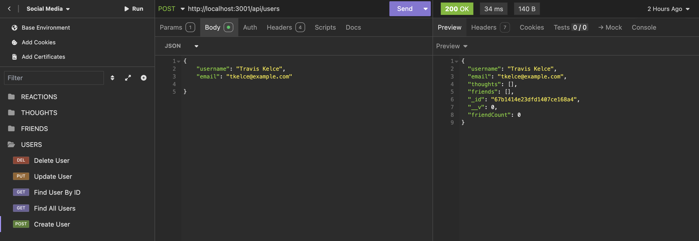
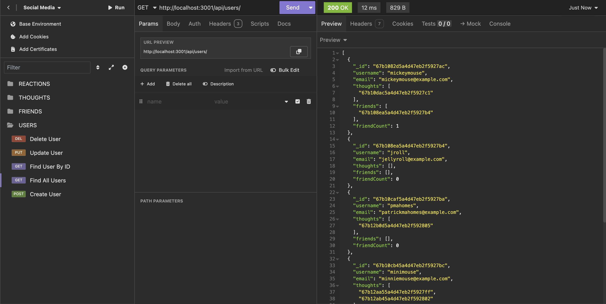
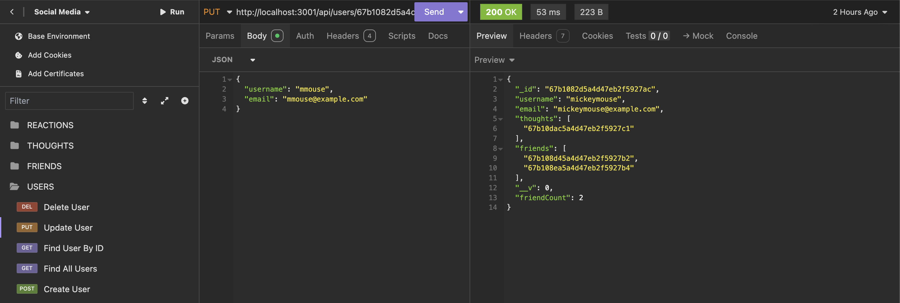
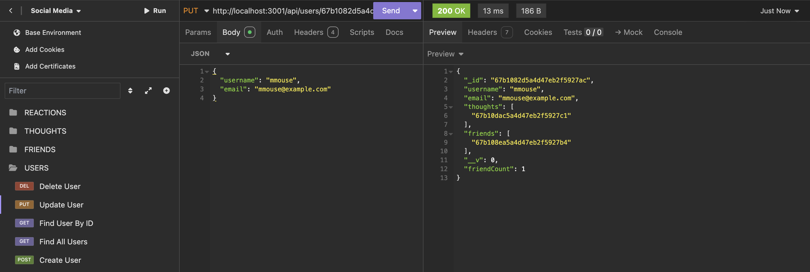
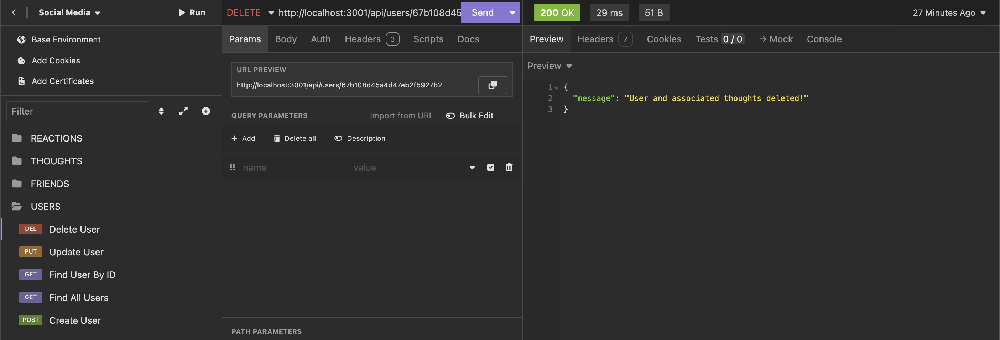
### Thoughts
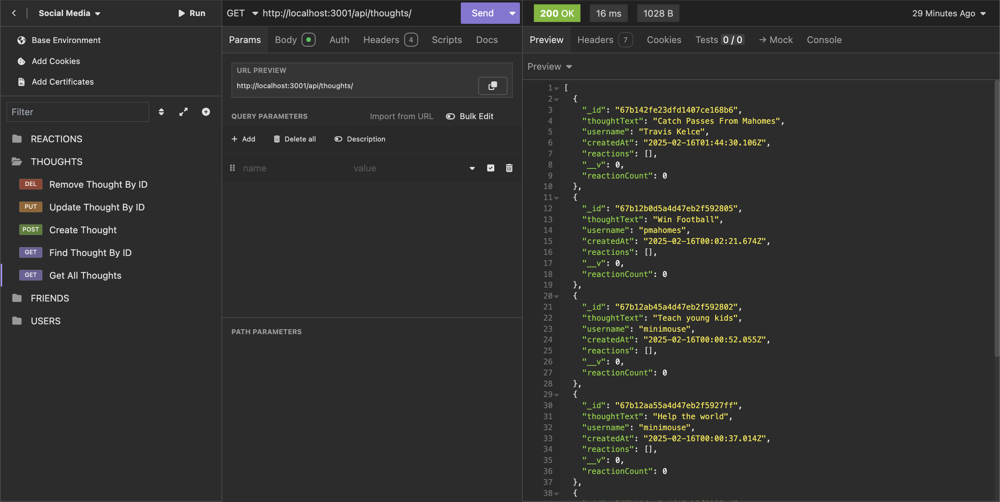
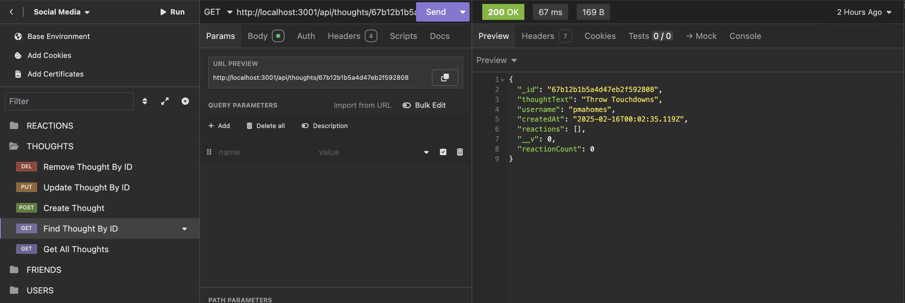
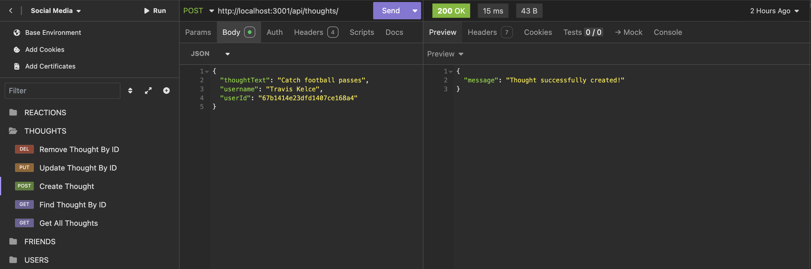
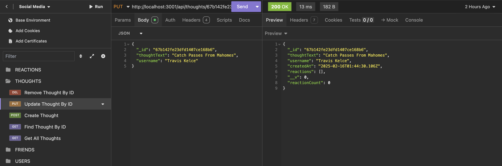
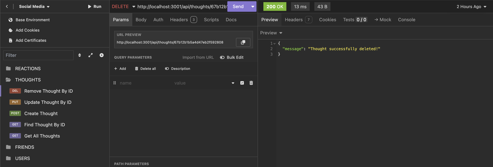
### Reactions
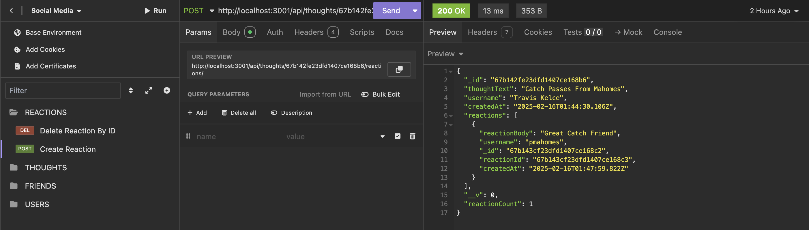
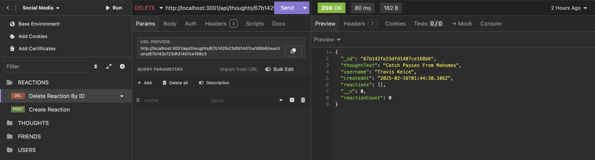
### Friends List
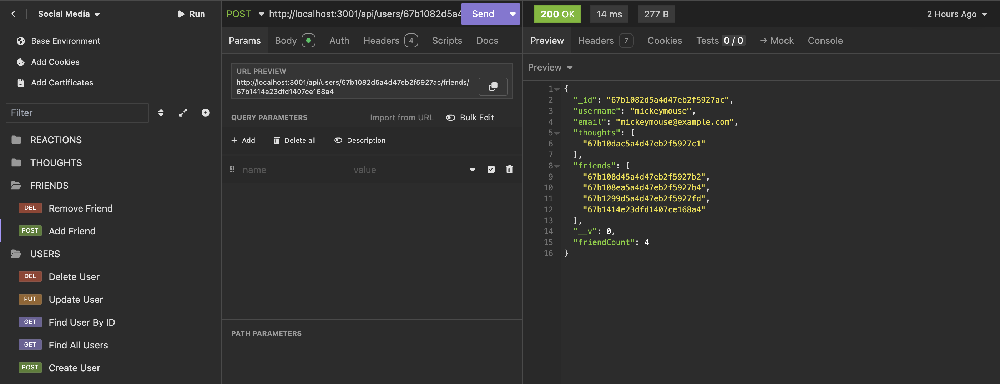
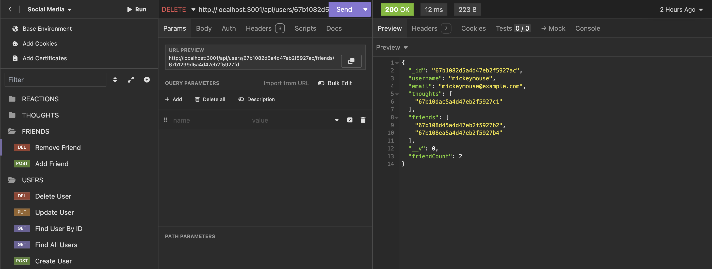

## Installation
1. Fork the repo to your local machine
2. Install the necessary dependencies using: 
   ```
   npm install
   ```
3. Set up a .env file and connect it to MongoDB
4. Start the server using:
   ```
   npm start
   ```

## API Routes
### Users
- `GET /api/users` – Find all users
- `GET /api/users/:id` – Find a user by ID
- `POST /api/users` – Create a user
- `PUT /api/users/:id` – Update a user
- `DELETE /api/users/:id` – Delete a user

### Thoughts
- `GET /api/thoughts` – Get all thoughts
- `GET /api/thoughts/:id` – Find a thought by ID
- `POST /api/thoughts` – Create a thought
- `PUT /api/thoughts/:id` – Update a thought
- `DELETE /api/thoughts/:id` – Remove a thought

### Reactions
- `POST /api/thoughts/:thoughtId/reactions` – Create a reaction to a thought
- `DELETE /api/thoughts/:thoughtId/reactions/:reactionId` – Delete a reaction

### Friends
- `POST /api/users/:userId/friends/:friendId` – Add a friend
- `DELETE /api/users/:userId/friends/:friendId` – Remove a friend

## Testing
Use **Insomnia** or **Postman** to test API endpoints. Ensure that the server is running before making requests.

## License
This project is licensed under the MIT License.

## Contributing
Contributions welcome for this project! Feel free to fork the repository, make your changes, and submit a pull request.

## Contact
* GitHub: celeste-hayes